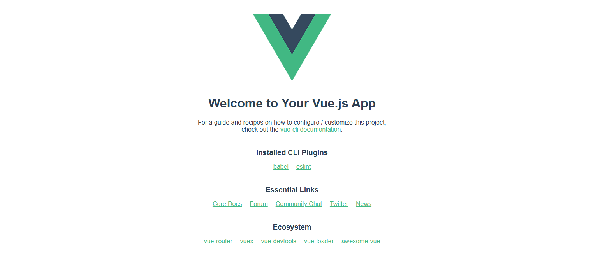

 # Vue.js 환경 구성하기
💡 Vue.js 프로젝트를 설치하고 화면 전환 및 Bootstrap 사용방법을 기술합니다.

 ## 1. Vue 이해하기
 - 컴포넌트 기반의 SPA를 구축할 수 있게 해주는 프레임워크
 - **Component**
    - 웹을 구성하는 로고, 메뉴바, 버튼 등 웹 페이지 내 다양한 UI 요소
    - 재사용 가능하도록 구조화
 - **SPA(Single Page Application)**
    - 하나의 페이지 안에서 필요한 영역 부분만 로딩되는 형태
    - 빠른 페이지 변환과 적은 트래픽이 장점

 ## 2. Vue vs React
 - **Vue**
    - 직관적인 API와 반응성을 강조
    - 양방향 데이터 바인딩을 지원하여, 데이터가 변경되면 UI도 자동으로 업데이트
    - Vuex를 사용하여 중앙 집중식 상태 관리를 제공
- **React**
    - JavaScript의 모든 기능을 활용할 수 있어 유연성이 높지만, 다소 복잡함
    - 단방향 데이터 흐름을 따르며, 데이터가 부모 컴포넌트에서 자식으로 전달되며 상태 변경 시 자식 컴포넌트가 다시 렌더링
    -  Redux, Context API 등을 사용하여 상태 관리를 구현

## 3. Vue CLI 설치하기
- **Vue CLI**는 Vue.js 애플리케이션을 쉽게 생성하고 관리할 수 있도록 도와주는 도구
- 기본 설정이 완료된 다양한 템플릿을 제공
- `npm install -g @vue/cli` 으로 Vue CLI 설치

## 4. Vue 프로젝트 생성하기
- `vue create {프로젝트명}` 으로 프로젝트 생성
- 명령어를 입력하면 옵션 선택항목이 나오는데 `Default ([Vue 3] babel, eslint)` 선택 
    - bable : JavaScript 컴파일러로, 최신 JavaScript(ES6+) 코드를 구식 브라우저에서도 호환되도록 변환 지원
    - eslint : JavaScript 코드의 품질과 일관성을 유지하기 위한 정적 코드 분석 도구
- 만약에 설치 시 오류가 발생하면 PowerShell에서 다음 항목을 점검
    - `Get-ExecutionPolicy -List` 실행하여 정책 확인
    - CurrentUser 또는 LocalMachine 항목이 Restricted로 설정되어 있으면, `Set-ExecutionPolicy -ExecutionPolicy RemoteSigned -Scope CurrentUser` 명령을 실행하여 정책 변경
    - 환경변수 확인을 위해 `$env:Path -split ';'` 실행하여 `C:\Users\{PC}\AppData\Roaming\npm` 경로가 존재하는지 확인

## 5. 코드구성 이해하기
 ```vue
 <template>
 <!-- Html 영역 -->
</template>

<script>
// Javascript 영역
</script>

<style>
/* 스타일 영역 */
</style>
 ```  

## 6. 생성된 프로젝트 실행하기
 - 프로젝트 경로로 이동하고 `npm run serve` 명령을 실행
 - http://localhost:8080/ 에 접속하여 페이지 확인 (서버 종료는 <kbd>Ctrl</kbd> + <kbd>C</kbd>) 

 

## 7. BootstrapVue 설치하기
 - Bootstrap은 웹 개발을 위한 오픈 소스 프론트엔드 프레임워크
 - [공식 사이트](https://bootstrap-vue.org/)에서 컴포넌트 예시 확인 가능
 - `npm install vue bootstrap bootstrap-vue` 명령으로 설치

## 8. Router 설치하기
 - **Router**는 웹 애플리케이션의 URL과 컴포넌트를 매핑하여 페이지 간의 전환을 관리
 - `npm install vue-router --save` 명령을 실행하여 설치
 
## 9. Router 구성하기
 - 📁 src\components 경로에 layout 폴더 생성 
 - layout 폴더에 Header.vue 파일 생성  
 

<br/>  
<br/>  

출처 : [한시간만에 끝내는 Vue.js입문=유튜브](https://youtu.be/sqH0u8wN4Rs?si=E0vuKs3Is6MfqzmF)